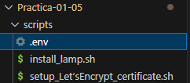
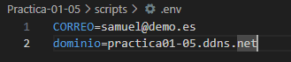

# Practica-01-05

### HTTPS con Let’s Encrypt y Certbot

Para est practica, contrario a la anterior, se va a estar haciendo uso de una **autoridad de certificación** (no autofirmado) la autoruidad de donde lo sacaremos será de **Let’s Encrypt**, usando el cliente de **Certbot**. La finalidad de la práctica es realziar la configuracón de un certificado **SSL/TLS** para poder navegar por **HTTPS**.

## 1. Instalación previa de la pila
Para la realización de esta práctica habrá que realizar la instalación de la pila **LAMP** en otro script, pero dado a que es el mismo procedimento dado en prácticas anteriores omitire la documentación de los pasos. 

## 2. Instalación de Certbot:

En esta parte de aquí se comenzará con la instalación y actualización del gestor de paquetes `snapd`

```
snap install core
```
```
snap refresh core
```

Para evitar conflictos, se puede emplear el siguiente comando para **borrar alguna instalación previa** en caso de **existir**:

```
apt remove certbot
```

### 2.1 Implantación del cliente de Certbot:

Haciendo uso de este comando se puede realizar la instalación del cliente de **Certbot**:

```
snap install --classic certbot
```

Seguidamente, para evitar tener que desplazarnos a la ruta completa podemos crear un **enlace simbolico** y especificarle la ruta por defecto donde esta los **ejecutables** en linux.

1. Mediante el parámetro `f` indico que sobreescriba el enlace en caso de existir.
2. Mediante el parámetro `s` indico que cree un enlace simbólico y no uno duro.

```
ln -fs /snap/bin/certbot /usr/bin/certbot
```

### 2.2 Obtención del certificado:

Antes de nada habrá que tener creado un archivo **.env** donde estarán definidas las variables que se usaran para automatizar el proceso de obtención del certificado. (habrá que llamarlas mediante el **source .env**)



Su contenido interno será **2 variables**, una para el **correo** y otra par el **nombre de dominio**:



Seguidamente se puede empezar con la **obtención automatizada** del **certificado**.

1. El **parametro clave** para **automatizar** estas respuestas es `--non-interactive` ya que hace que no se solicite **ningún dato** por **teclado**.

```
certbot --apache -m $TU_CORREO --agree-tos --no-eff-email -d $TU_DOMINIO --non-interactive
```
